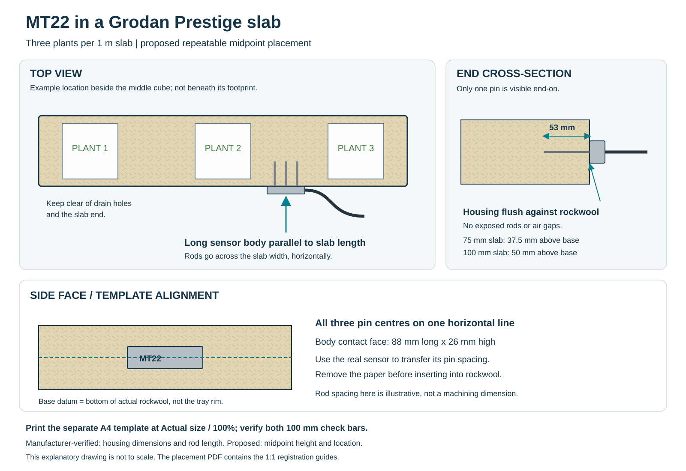

# TDR Sensor

An ESPHome reader for the **INFWIN MT22A SDI-12** substrate probe, with checked water-content calibration, bulk EC, temperature and observed dryback trends. Runs locally on ESP32/M5Stack hardware with a web page, Home Assistant, optional MQTT and CSV logging.

**Open the [live substrate and calibration setup desk](https://jaketherabbit.github.io/TDR-Sensor/).** It covers cubes, cubes on shared slabs, coco containers, metric/custom sizes, weighed calibration records and an actual-size printable placement sheet. The [field guides](https://jaketherabbit.github.io/TDR-Sensor/guides/) are readable on the site too.

For offline use, download this repository ZIP, extract it and open [tools/setup/index.html](tools/setup/index.html) in a browser. Calculator entries stay in your browser; the site does not connect to or control a sensor.



## What changed in v3

- A saturated/drained capture saves a **wet-reference index**, not an invented 100% VWC.
- Headline VWC requires **two weighed points and an independent third-point check**. It is withheld during calibration, outside the fitted range and when data is stale.
- RAW, generic VWC, weighed estimates, bulk EC and optional modelled pore EC are distinguished. The unsupported bulk/VWC–Hilhorst blend has been removed.
- Cube + shared-slab volume is calculated once and allocated per plant. Real metric block sizes are used, including the nominal six-inch Hugo at about 3.2 L.
- Measured trends replace claims of vegetative/generative state or physiological confidence. Plateau detection, freshness and calibration-history resets are fixed.
- Firmware dependencies and CI use explicit versions. Host tests execute the actual calibration and analytics code extracted from the YAML.

Existing users: read [the v3 migration notes](docs/MIGRATION-v3.md) before upgrading. Old calibration values are not silently promoted into checked VWC.

## Choose a path

| Task | Guide |
|---|---|
| Work out cube, slab-share or coco volume | [Substrates and sizes](docs/SUBSTRATES.md) · [offline calculator](tools/setup/index.html) |
| Place the probe / print a template | [Placement](docs/PLACEMENT.md) · [A4 75/100 mm slab PDF](docs/print/MT22-placement-template-A4-actual-size.pdf) |
| Save a wet reference or calibrate with weights | [Calibration procedure](docs/CALIBRATION.md) |
| Build a device config / enable MQTT | [Configuration](docs/CONFIG.md) |
| Connect the hardware | [Wiring](docs/WIRING.md) · [sensor compatibility](docs/SENSORS.md) |
| Integrate with Home Assistant | [Dashboard and guarded shot requests](docs/HOMEASSISTANT.md) |
| Resolve unavailable readings | [Troubleshooting](docs/TROUBLESHOOTING.md) |
| Assess the claims and limits | [Sources](docs/SOURCES.md) · [validation](docs/VALIDATION.md) |

## ESPHome installation

Build with **ESPHome 2026.8.2**, the tested version. Clone/download the repo, copy `esphome/secrets.yaml.example` to `esphome/secrets.yaml`, enter your own values, and use the device YAML for your board. See [CONFIG.md](docs/CONFIG.md). Nothing in this repository flashes an existing node automatically.

```yaml
substitutions:
  name: tdr-sensor
  friendly_name: TDR Sensor
  sdi12_data_pin: GPIO26
  sdi12_address: "0"
  sample_interval: 30s

packages:
  tdr:
    url: https://github.com/JakeTheRabbit/TDR-Sensor
    ref: main  # Pin a reviewed commit SHA for a production build.
    files:
      - esphome/packages/boards/atom-lite.yaml
      - esphome/packages/tdr_sdi12_core.yaml
      - esphome/packages/tdr_analytics.yaml
      - esphome/packages/wifi_extras.yaml

wifi:
  ssid: !secret wifi_ssid
  password: !secret wifi_password
  ap: {}

ota:
  - platform: esphome
```

Optional API encryption, OTA password, web credentials and fallback-AP credentials belong in your own secrets file; [examples are in CONFIG.md](docs/CONFIG.md). Public factory images contain no private credentials. Use a trusted local network for provisioning.

Supported board configurations: Atom Lite (GPIO26), AtomS3 Lite (GPIO1), Atom PoE (GPIO26), M5 Dial (GPIO2), and generic ESP32 (GPIO16). These are build targets; physical wiring and probe accuracy require installation checks. PoE uses Ethernet and excludes the Wi-Fi package. See the [flashing guide](docs/FLASHING.md) for prebuilt releases; older releases may still contain v2 behaviour until a v3 release is published.

## Measurements, trends and control

The web page exposes raw counts, temperature, bulk EC at 25°C, wet-reference index and calibration controls. Once checked VWC is available, the optional analytics package tracks peak/trough VWC, dryback in percentage points and percent of peak, a rolling drying slope, and detected wetting events. A wetting event is not proof that a valve opened or that a known volume reached the plants. Runtime history resets when measurement continuity is lost.

One probe measures a local region. There are no universal cube/slab/coco VWC targets, and no claim that a substrate curve measures plant water stress, yield or potency. The node itself does not drive irrigation. The Home Assistant example requests an independently bounded controller shot only after explicit enabling and valid readings.

Bulk EC is the primary EC output. The optional Hilhorst pore-EC estimate is experimental and starts disabled. Calibrating a wet reference or bulk EC does not validate a pore-water model.

## Logging and development

```sh
python tools/tdr_logger.py 192.168.1.50 --wide --interval 60 --out grow.csv
node --test tests/calculator.test.js
python tests/test_firmware.py
esphome compile esphome/factory/tdr-sensor-atom-lite-factory.yaml
```

The logger reads the local web event stream. See [VALIDATION.md](docs/VALIDATION.md) for dependencies and test scope. The existing [root-zone measurement paper](https://jaketherabbit.github.io/cannabis-white-papers/root-zone-teros12.html) provides additional discussion; hardware specifications and calibration limits for this implementation are documented in [SOURCES.md](docs/SOURCES.md).


CSV logging: wide format now records each field's observation age, blanks readings after `--max-age` (default 120 seconds) or a disconnected stream, and refuses to append a mismatched header. Start a new CSV after upgrading. Use long format for entities that appear after the initial snapshot; wide mode warns rather than silently dropping new columns. Adjust maximum age to the actual reporting cadence, not the desired irrigation interval.
