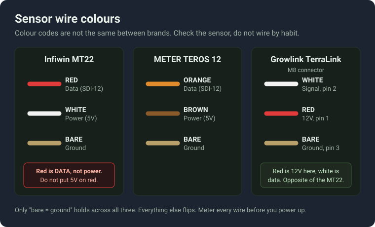
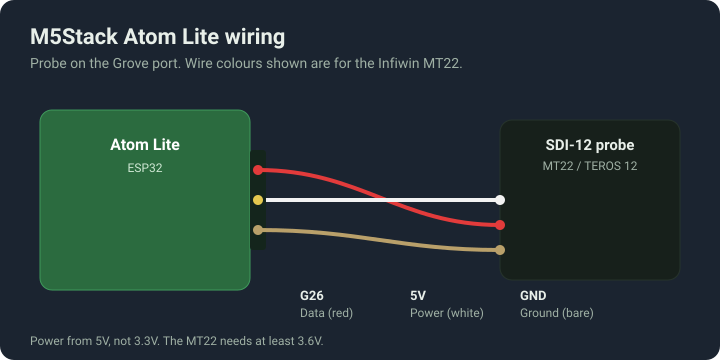
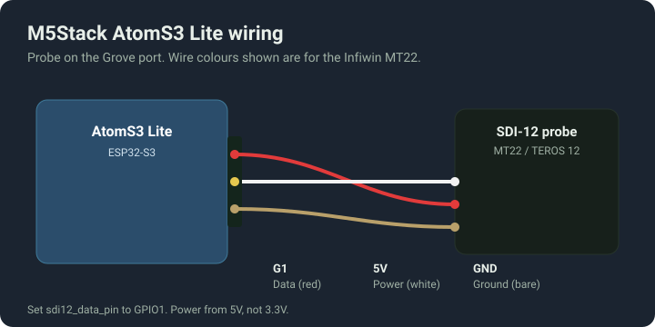
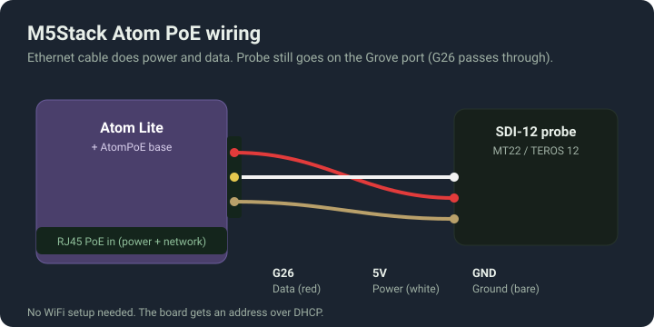
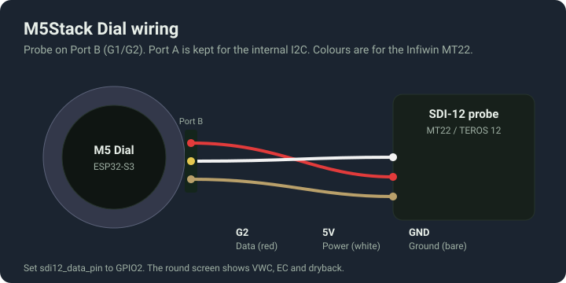
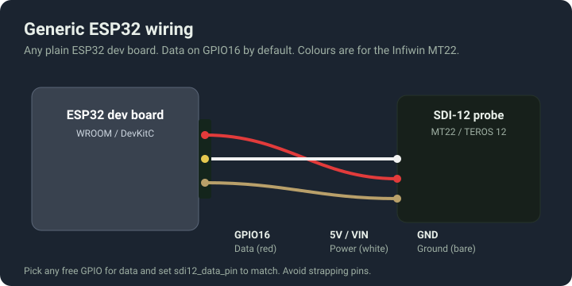

# Wiring and placement

Everything about getting the probe connected to the board and into the substrate. Read the wire colours section before you connect anything. The colour codes are not the same between sensor brands and getting it wrong can damage the data pin.

## The one thing that breaks most builds

This project uses a half-duplex UART, which only works on the ESP32 with the esp-idf framework and the ssieb fork the config already pulls in. ESP8266 and Arduino are not supported by these configurations; validation or communication can fail. The device boots, joins WiFi, serves the web page, and every reading sits at unknown. If that is what you are seeing, this is almost always why. Stay on the board files in this repo and do not change the framework.

## Wire colours

The wire that carries data is a different colour on every brand. Confirm every connection against the exact sensor manual before power-up; do not infer functions from colour alone.

| Function | Infiwin MT22 | METER TEROS 12 | Growlink TerraLink (M8) |
|---|---|---|---|
| SDI-12 data | Red | Orange | White (pin 2) |
| Power | White | Brown | Red (pin 1) |
| Ground | Bare | Bare | Bare (pin 3) |

On the MT22 the red wire is data, not power. If you wire it the way you would wire anything else, red to the 5V rail, you put 5V on the data pin. Check it.

Power the probe from 5V. The MT22 wants somewhere between 3.6V and 16V, so the 3.3V rail is not enough. The Grove ports on the M5 boards run 5V, which is correct.

## Board wiring

Each board brings the SDI-12 data line out on a different pin. The data pin is the only setting you need to match in your config, through the sdi12_data_pin substitution. Power and ground are the 5V and GND on the same connector.

### M5Stack Atom Lite

Data on G26, which is the Grove port. This is the default, so the stock config needs no changes.

### M5Stack AtomS3 Lite

Data on G1 (Grove port). The device file sets sdi12_data_pin to GPIO1 for you.

### M5Stack Atom PoE

Data on G26. The PoE base passes the Grove port straight through, so the probe wiring is the same as the bare Atom Lite. The ethernet cable carries both power and network, so there is no WiFi to set up. The board comes up on DHCP.

### M5Stack Dial

Data on G2, which is Port B. Port A is left alone because the Dial uses it for its internal I2C. The device file sets sdi12_data_pin to GPIO2.

### Generic ESP32

Data defaults to GPIO16. Any free GPIO works, just set sdi12_data_pin to match and stay off the strapping pins (GPIO0, 2, 12, 15) unless you know what you are doing. Power the probe from the 5V or VIN pin.

## Placement and interface checks

Use the dedicated [placement guide](PLACEMENT.md) and [actual-size MT22 templates](print/MT22-placement-template-A4-actual-size.pdf). The earlier generic “small orange” sensing volume, angled top insertion and claim that mid-height equals whole-block average were not adequate MT22-specific placement evidence and have been removed.

The diagrams show logical pin assignments. Verify the sensor's electrical output levels against ESP32 input limits before direct connection; SDI-12 is not simply a generic 3.3 V UART connection. Use a suitable SDI-12 interface/buffer if the signalling voltage requires it. The UART software's half-duplex setting does not provide voltage protection. This revision has build validation, not a physical certification of every illustrated wiring combination.

Primary pinout reference: [INFWIN MT22 manual](https://www.infwin.com/wp-content/uploads/UM-MT22-SDI-12-Soil-Moisture-EC-and-Temperature-Sensor-V6.01.pdf). Treat diagrams for other probe brands as requiring their own current manual check.
